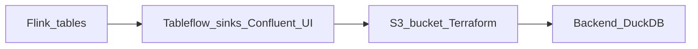

# Confluent Cloud Terraform (Environment, Kafka, Flink, Keys)

Use **three separate Terraform root modules** (each has its own state file):

| Stack | Path | Purpose |
|-------|------|--------|
| **Confluent core** | `IaC/` (this directory) | Environment, Kafka, Schema Registry (data), Flink pool, service account, API keys |
| **Flink SQL statements** | `IaC/flink-statements/` | `confluent_flink_statement` resources from `../pipelines/inventory.json` |
| **Tableflow (AWS)** | `IaC/aws/` | S3 bucket and IAM; Tableflow connections/sinks in the Confluent UI |

**Apply order:** (1) `terraform apply` in `IaC/` (2) `IaC/flink-statements/` (reads `IaC/terraform.tfstate` by default via `terraform_remote_state`) (3) `IaC/aws/` (independent; can be before or after statements).

**Migrating from a monolith state:** If an older state had Flink statements or S3 in `IaC/`, use `terraform state rm` (or destroy) for those resources before creating them in the new roots to avoid duplicate management.


This `README` primarily documents the **Confluent core** in this folder. You can also create or attach to an environment and/or Kafka cluster using variables.

## Resources

| Resource            | Created ...                          |
|---------------------|----------------------------------------|
| Confluent Environment | When `environment_id` is not set     |
| Kafka Cluster       | When `kafka_cluster_id` is not set    |
| Service Account     | When `service_account_id` is not set  |
| Flink Compute Pool  | When `flink_compute_pool_id` is not set |
| Demo app API keys   | Always (Kafka, Schema Registry, Flink; see `app_credentials.tf`) |


## File structure (this directory = Confluent core)

```
├── main.tf                    # Provider and data sources
├── variables.tf               # Variable definitions
├── terraform.tfvars.example  # Example for Confluent core only
├── env.tf                     # Environment (create or use existing)
├── kafka.tf                   # Kafka cluster (create or use existing)
├── schema_registry.tf         # Schema Registry data source
├── app_credentials.tf         # Service account, RBAC, Kafka/SR/Flink API keys
├── flink.tf                   # Flink compute pool
├── outputs.tf                 # Output values (includes cloud_provider/region for flink-statements remote state)
├── README.md                  # This file
├── validate_tableflow.sh      # Runs against IaC/aws state
├── aws/                       # Separate state: S3 and IAM for Tableflow
└── flink-statements/          # Separate state: Flink SQL from pipelines/inventory.json
```

## Prerequisites

1. **Confluent Cloud account** with API access.
2. **Cloud API key and secret** with permissions to create environments, clusters, service accounts, role bindings, API keys, and Flink compute pools (e.g. OrganizationAdmin, or EnvironmentAdmin + appropriate roles for the create path).

## Credentials from `backend/.env`

Reuse [`backend/.env`](../backend/.env) to supply **only** Terraform variables (`TF_VAR_*`) such as `confluent_cloud_api_key` / `confluent_cloud_api_secret`, `cloud_provider`, etc. From the **repository root**:

```sh
source ./set_env_var && cd scripts && source ./export_terraform_env.sh
cd ../IaC 
terraform init -upgrade
terraform plan
```

[`export_terraform_env.sh`](../export_terraform_env.sh) maps `.env` names to Terraform inputs (see [`backend/.env.example`](../backend/.env.example)). It does **not** set removed variables for Flink keys; those come from Terraform outputs after apply.

[`main.tf`](main.tf) sets Kafka, Schema Registry, Flink arguments to empty strings so shell variables such as `FLINK_API_KEY` or `KAFKA_API_KEY` from `.env` do not partially configure the Confluent provider (“all or none” validation).

### Cloud API credentials for Terraform

Do not commit `terraform.tfvars` (may contain secrets). The scripts above should have set TF_VAR_*, if not you can manually do:

```sh
export TF_VAR_confluent_cloud_api_key="<your-cloud-api-key>"
export TF_VAR_confluent_cloud_api_secret="<your-cloud-api-secret>"
```

### After terraform  apply: backend Kafka / SR / Flink keys

Terraform creates a **demo app service account** and three API keys (Kafka, Schema Registry, Flink). Key secrets are stored in Terraform state; treat state as confidential.

```sh
cd IaC
terraform output -raw backend_env_snippet >> ../backend/.env.local   # example: merge into a new file first
# Or inspect structured map:
terraform output -json backend_env
```

Individual outputs: `app_service_account_id`, `app_kafka_api_key_id`, `app_kafka_api_key_secret`, `app_schema_registry_api_key_id`, `app_schema_registry_api_key_secret`, `app_flink_api_key_id`, `app_flink_api_key_secret`.

To merge the `backend_env` map into an existing [`backend/.env`](../backend/.env) (update only keys that differ or are missing; skip the write if nothing changed), from the repo root:

```sh
./scripts/update_backend_env_from_terraform.sh
# Preview: ./scripts/update_backend_env_from_terraform.sh --dry-run
```

If a `terraform apply` fails on **RBAC** (role or CRN), adjust `confluent_role_binding` resources in [`app_credentials.tf`](app_credentials.tf) per [Confluent predefined RBAC roles](https://docs.confluent.io/cloud/current/security/access-control/rbac/predefined-rbac-roles.html). `DataSteward` for Schema Registry must use the environment `resource_name` (`local.environment_resource_name`), not the Schema Registry cluster CRN—Confluent rejects `DataSteward` / `ResourceOwner` on `SchemaRegistry` cluster scope.


## Clean (destroy managed resources)

> **Why `destroy` didn’t delete my environment, Kafka cluster, or Flink pool**  
> If `terraform.tfvars` sets `environment_id`, `kafka_cluster_id`, and/or `flink_compute_pool_id`, Terraform does not manage those objects—it only reads them. The Schema Registry cluster is a data source only. `terraform destroy` in this directory only removes what this state created (e.g. API keys, role bindings, created pool/cluster/env). Flink statements and S3/Tableflow IAM live in `../flink-statements` and `../aws`—destroy them separately from those directories. To remove the Confluent environment or cluster, use the [Confluent Cloud](https://confluent.cloud) UI/CLI, or use variables so Terraform created those resources in the first place.

```sh
terraform destroy
```

- If you created resources with this Terraform, they will be destroyed (environment, Kafka cluster, service account, Flink compute pool, API keys).
- If you used existing resources (via variables), only resources this stack created are destroyed; existing resources are not removed.
  - Existing environment → not destroyed
  - Existing Kafka cluster → not destroyed
  - Existing service account → not destroyed (but role bindings created by Terraform will be removed)
  - Existing Flink compute pool → not destroyed
  - API keys → always destroyed (they were created by Terraform)

## Flink statement deployment (separate stack)

> **Not recommended for production**.

Flink SQL is deployed from [`IaC/flink-statements/`](flink-statements) (own state), not this directory. It loads [`../pipelines/inventory.json`](../pipelines/inventory.json) and, by default, reads pool ID, service account, Flink key, and display names from `IaC/terraform.tfstate` via `terraform_remote_state` after the Confluent core has been applied.

```sh
cd flink-statements
cp terraform.tfvars.example terraform.tfvars
# set confluent_cloud_api_key / confluent_cloud_api_secret
terraform init
terraform plan
terraform apply
```

- **Phases:** Raw DDL → RMD DDL → raw DML → RMD DML, with `depends_on` and optional DML `.properties` files.
- **Outputs** (`flink_statements_ddl_raw`, `flink_statements_dml_*`, …) are in the flink-statements state.
- **Manual input instead of remote state:** set `use_confluent_remote_state = false` and set `environment_id`, `flink_api_key_id`, and other variables in `IaC/flink-statements/terraform.tfvars` (see example file there).

Troubleshooting: same as before (SQL, phase order, RBAC, [provider docs](https://registry.terraform.io/providers/confluentinc/confluent/latest/docs/resources/confluent_flink_statement)).

## Outputs

```sh
terraform output
```

Useful outputs:

- Infrastructure: `env_id`, `kafka_cluster_id`, `kafka_bootstrap_endpoint`, `kafka_rest_endpoint`
- `cloud_provider`, `cloud_region` (for `IaC/flink-statements` when using `terraform_remote_state`)
- Schema Registry: `schema_registry_id`, `schema_registry_endpoint`
- Flink: `flink_compute_pool_id`, `flink_rest_endpoint`
- Demo credentials: `app_service_account_id`, `app_*_api_key_*`, `backend_env`, `backend_env_snippet` (sensitive)
- S3/Tableflow outputs: apply **`IaC/aws/`** and use outputs there (`s3_analytics_bucket`, `analytics_s3_paths`, `tableflow_iam_role_arn`, `tableflow_note`)
- Flink statement output maps: in **`IaC/flink-statements/`** apply output

## Variables summary

| Variable                      | Required | Description |
|------------------------------|----------|-------------|
| `confluent_cloud_api_key`    | Yes      | Confluent Cloud API key |
| `confluent_cloud_api_secret` | Yes      | Confluent Cloud API secret |
| `environment_id`             | No       | Existing environment ID; when set, no environment is created |
| `kafka_cluster_id`           | No       | Existing Kafka cluster ID; when set, no cluster is created (requires `environment_id`) |
| `service_account_id`         | No       | Existing service account ID; when set, no service account is created (API keys still created) |
| `service_account_display_name` | No   | Override display name when creating the demo service account (avoid 409 if `{prefix}-demo-app` exists) |
| `flink_compute_pool_id`      | No       | Existing Flink compute pool ID; when set, no pool is created (requires `environment_id`) |
| `cloud_provider`             | No       | e.g. `AWS` (default) |
| `cloud_region`               | No       | e.g. `us-west-2` (default) |
| `prefix`                     | No       | Prefix for resource names (default `health`) |
| `flink_compute_pool_name`    | No       | Flink pool display name |
| `flink_compute_pool_max_cfu` | No       | Max CFU for the pool (default `5`) |

Flink statement and Tableflow (AWS) variables are defined in `IaC/flink-statements/variables.tf` and `IaC/aws/variables.tf`.

Kafka, Schema Registry, and Flink **application** API keys are not top-level “optional pass-through” in most cases; they are created in [`app_credentials.tf`](app_credentials.tf) and exposed via outputs.

## Tableflow and S3 (stack `IaC/aws/`)

**Tableflow** replicates data from Flink tables in Confluent Cloud to S3. **Terraform in [`IaC/aws/`](aws)** creates the **S3 bucket and IAM role/policy**; **Tableflow connections and sinks are created in the Confluent Cloud UI** (this repo does not manage them as `resource` blocks).



Intended paths after you configure sinks (prefixes under the Terraform-managed bucket):

| Flink table (source)   | S3 prefix (destination)   |
|------------------------|----------------------------|
| `hc_fct_dev_anomaly`   | `anomalies/`               |
| `hc_fct_drift_evts`    | `prescription_changes/`    |
| `hc_fct_telemetries`   | `telemetries/`             |

### What Terraform creates vs. what you configure in the UI

| Automated (Terraform) | Manual (Confluent UI) |
|------------------------|------------------------|
| S3 bucket, versioning, encryption, lifecycle | Tableflow **connections** to S3 (IAM role) |
| IAM role trust to Confluent + S3 policy | Tableflow **sinks** from each fact table to bucket prefixes |

### Prerequisites

- Flink fact tables deployed and running (e.g. apply `IaC/flink-statements/` and pipelines).
- **AWS** permissions for S3 and IAM.
- **Confluent Cloud** with Tableflow available for the environment.
- **External ID** for cross-account IAM (from the Confluent UI: Environment → Settings → Tableflow, or Confluent Support).

### 1. Configure Terraform (AWS stack)

In [`IaC/aws/terraform.tfvars`](aws/terraform.tfvars) (or `-var`):

```hcl
enable_tableflow         = true
confluent_external_id   = "your-external-id-from-confluent"
confluent_aws_account_id = "761327592718"
# Optional: confluent_environment_id = "env-xxxxx"  # S3 object tags only
```

Set **AWS credentials** for the account where the bucket and role are created, for example:

```sh
export AWS_PROFILE=your-profile
# or
export AWS_ACCESS_KEY_ID=...
export AWS_SECRET_ACCESS_KEY=...
export AWS_REGION=us-west-2
```

From `IaC/aws` (or `terraform -chdir=aws` from `IaC`):

```sh
cd aws
terraform init
terraform plan
terraform apply
```

This creates the analytics bucket (name includes a random suffix), IAM role, and policy attachment. It does **not** create Confluent Tableflow connection or sink resources.

### 2. Collect values for the Confluent UI

```sh
cd aws   # or: terraform -chdir=IaC/aws
terraform output -raw s3_analytics_bucket
terraform output -raw tableflow_iam_role_arn
terraform output -json analytics_s3_paths
```

Keep `confluent_external_id` from your `IaC/aws/terraform.tfvars` at hand for the connection dialog.

### 3. Create connections and sinks in the Confluent UI

In [Confluent Cloud](https://confluent.cloud), select your environment → **Tableflow** → add a connection (Amazon S3, **IAM role** auth: paste the role ARN and External ID, then test).

For **each** of the three fact tables, create a **sink** (you may use one connection for all three or separate connection names as you prefer):

1. **Anomalies** — Source: catalog = environment id, database = Kafka cluster id, table = `hc_fct_dev_anomaly`. Destination: your bucket, prefix `anomalies`. Format: Parquet; partition by `date` (or your time column) as required by your table schema.
2. **Prescription / drift** — Table `hc_fct_drift_evts` → prefix `prescription_changes/`.
3. **Telemetries** — Table `hc_fct_telemetries` → prefix `telemetries/`.

Wait until each sink shows **Running** in the UI. Expect roughly 10–15 minutes one-time if stepping through all dialogs.

### 4. Point the backend at S3

Merge bucket name into [`backend/.env`](../backend/.env) (see also [`../scripts/update_backend_env_from_terraform.sh`](../scripts/update_backend_env_from_terraform.sh) for other keys):

```sh
BUCKET_NAME=$(cd IaC/aws && terraform output -raw s3_analytics_bucket)
# Append or set:
# ANALYTICS_S3_BUCKET=<bucket>
# ANALYTICS_S3_PREFIX=
# AWS_REGION=<same as bucket>
```

Disable local-only sample paths if you used them:

```sh
# ANALYTICS_LOCAL_PATH=...
```

Restart the backend (e.g. `docker compose restart backend` or your `uvicorn` process).

### 5. Verify

```sh
# From the IaC directory
./validate_tableflow.sh
```

**S3 (after data has landed):**

```sh
aws s3 ls "s3://$(cd IaC/aws && terraform output -raw s3_analytics_bucket)/anomalies/" --recursive
```

**API:**

```sh
curl -s http://localhost:8000/analytics/dashboard | jq '.available'
```

### S3 and IAM details

- **Bucket:** server-side encryption (AES256), versioning, lifecycle (see `IaC/aws/main.tf`).
- **IAM trust:** the role allows `sts:AssumeRole` from Confluent’s AWS account subject to `sts:ExternalId` matching your `confluent_external_id`.
- **Sink format:** Parquet and partitioning in the UI should match your Flink table columns (e.g. `date`).

### Tableflow troubleshooting

- **External ID / IAM** — `InvalidPermission` or connection test failure: confirm External ID with Confluent and that the role ARN in the UI matches `cd IaC/aws && terraform output -raw tableflow_iam_role_arn`.
- **Sink failed / no S3 data** — Confirm Flink SQL is running and the chosen partition column exists; sink not paused; allow a few minutes after start.
- **Backend analytics unavailable** — Check `ANALYTICS_S3_BUCKET`, AWS credentials for read access, and that objects exist under the expected prefixes.

### Cost and retention

- S3 standard storage and requests follow AWS pricing; Tableflow has Confluent usage charges (see current Confluent pricing).
- Use lifecycle rules (already in Terraform) and query pruning by partition to limit scan size.

### Disable or remove Tableflow infrastructure

- In `IaC/aws`: set `enable_tableflow = false` and `terraform apply`, or `terraform destroy` in that directory. **S3 data may remain** if you do not remove the bucket.

### Additional resources

- [Confluent Tableflow documentation](https://docs.confluent.io/cloud/current/tableflow/)
- [DuckDB S3 import](https://duckdb.org/docs/guides/import/s3_import.html)
- [Terraform AWS provider](https://registry.terraform.io/providers/hashicorp/aws/latest/docs)

### Success criteria (demo / Issue #5)

- S3 bucket and IAM created via Terraform.
- Three Tableflow sinks **Running** in the UI, writing to the three prefixes.
- Objects appear under `anomalies/`, `prescription_changes/`, `telemetries/` after pipeline traffic.
- Analytics API / dashboard can read from S3 (`./validate_tableflow.sh` and `curl` checks above).
