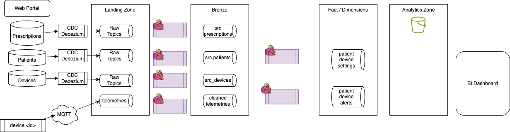
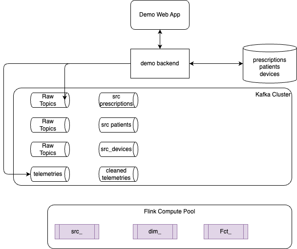

# Healthcare Data Streaming Processing Demonstration


## Goals

The scope will be to build an end-to-end demonstration starting from Debezium CDC to flink SQL to process (Raw->Bronze->Silver->Gold records), with tableflow to s3 parquet/iceberg tables 
- finalized by using duckdb queries 
- Use healthcare use case, like Patient records, health provider , and device monitoring. Address Compliance to a prescription, or out of sequence events. We could use Flink to compare Command/Intent (The Prescription) against Reality (The Telemetry). 
- Audiance is data engineers. 
- May be use HL7 FHIR.

### Pipelines Architecture

The figure should be self-explanatory



### Demonstration Components




### Running the demo backend

The **backend** is the demo API and telemetry producer: REST endpoints for patients, devices, and prescriptions, plus simulation control and telemetry SSE.

From the repo root, start the backend with Docker Compose:

```bash
# Set Confluent Cloud Kafka and Schema Registry credentials (see backend/.env.example)
cp backend/.env.example backend/.env
# edit backend/.env

docker compose up -d backend
```

API: `http://localhost:8000` — `GET /patients`, `GET /devices`, `GET /prescriptions`, `GET /health`, `GET /simulation/status`, `POST /simulation/start`, `POST /simulation/stop`, `GET /telemetry/stream` (SSE).

### Frontend

A Vue.js control plane runs in `frontend/` and provides a home page with left navigation (Patients, Devices, Prescriptions, Device telemetry), plus simulation control and live telemetry stream.

```bash
cd frontend
npm install
npm run dev
```

The app expects the backend API at `http://localhost:8000` by default. Override with `VITE_API_URL` (e.g. in `frontend/.env`). The control plane fetches patients, devices, and prescriptions from the backend and lets you start/stop the device simulation and connect to the live telemetry SSE stream.

## The Core Domain Classes

You typically need some main entities to show a meaningful "Patient Journey" in a stream: the Patient, the Provider, the Medical device and the Prescription. We want to measure drift. CPAPs/Ventilators-style devices, prescription drift can indicate:

* Mask Leak: If the pressure required to maintain airflow increases significantly, the mask may be fitted poorly.
* Patient Condition Change: If the patient's airway resistance changes, the device may no longer be providing effective therapy at the original prescribed level.
* Mechanical Wear: The motor may be failing to reach the target RPMs required for the prescribed pressure.

### A. Patient Class

This represents the static/slow-moving dimensions of the person.

```Java
public class Patient {
    public String patientId;   // Primary Key
    public String name;
    public String gender;
    public String birthDate;
    public String zipCode;     // Useful for Flink geo-aggregations
    
    // Default constructor for Flink/POJO serialization
    public Patient() {}
}
```

The Patient may have a device assigned to.

```java
public class Device {
   public String device_id;
   public String patientId;
   public double preassureSetting;
   public double flowRateSetting;
   public int flowLevel;
}
```


### B. Prescription Class

The "Desired State". It tells Flink what the device should be doing.

```Java
public class Prescription {
    public String prescriptionId;
    public String patientId;
    public String deviceId;
    public String medicationOrTherapy; // e.g., "CPAP Oxygen Flow"
    public String metricName;
    public double targetValue;          // e.g., 2.5 (Liters per minute)
    public double toleranceRange;      // e.g., 0.5 (Acceptable +/-)
    public long startDate;
    public long endDate;
    
    public Prescription() {}
}
```

### C. DeviceTelemetry 
The "Observed State": This is the high-velocity stream coming from the hardware.

```Java
public class DeviceTelemetry {
    public String deviceId;
    public String patientId;
    public long timestamp;
    public String metricName;          // e.g.,"Pressure"
    public double metricValue;
    public String softwareVersion;     // Crucial for manufacturers (debugging)
    
    public DeviceTelemetry() {}
}
```

### D. Drift Alert
```java
public class DriftAlert {
    public String deviceId;
    public String patientId;
    public String message;
    public double prescribedValue;
    public double actualValue;
}
```

### HealthProvider Class (Future extension)
This represents the doctor.

```Java
public class HealthProvider {
    public String providerId;
    public String organizationName;
    public String specialty;   // e.g., "Cardiology", "General Practice"
    public String NPI;         // National Provider Identifier
    
    public HealthProvider() {}
}
```

### Encounter ( (Future extension)
This is the "Fact" table that will flow through your Kafka topic. It is the most important class for Flink because it contains the timestamps.

```Java
public class Encounter {
    public String encounterId;
    public String patientId;    // Foreign Key to Patient
    public String providerId;   // Foreign Key to Provider
    public long timestamp;      // Event time for Flink Windowing
    public String type;         // e.g., "Inpatient", "Ambulatory", "Emergency"
    public double cost;         // For "Sum" or "Avg" aggregations
    public String diagnosisCode; // ICD-10 code
    
    public Encounter() {}
}
```

## The Flink Use Case

### Compliance Alerting

Use a join between the Prescription stream with the DeviceTelemetry stream to check for "Prescription Drift.
The prescriptions change rarely but apply to every telemetry point, we may want to use Broadcast State if done with DataStream. 
If DeviceTelemetry.metricValue is outside the Prescription.targetValue +/- toleranceRange for more than $X$ minutes, trigger an alert.
The Sink: Send the alert to a new Kafka topic: alerts.compliance.non-adherence.

### Device's health
Goal assess device reliability:

* Windowed Aggregation: Calculate the average BatteryLevel or InternalTemperature over a 1-hour tumbling window.
* Pattern Recognition: If the InternalTemperature increases by $>10% over three consecutive windows while FlowRate remains constant, the device may have a clogged filter.


If we do an insulin pump, we can have Flink detecting a spike in BloodGlucose (Telemetry). Then checks the Prescription for the maximum allowable dose, to finally sends a command back to a Kafka topic `device.commands` to trigger an insulin bolus automatically.


## Deployment

* Be sure to have set env variables. See[.env.example](.env.example)

### With shift left tool

```sh
source set_j9r_env
shift_left table build-inventory $PIPELINES
shift_left pipeline build-all-metadata
shift_left pipeline deploy --table-name device_metrics --compute-pool-id $FLINK_COMPUTE_POOL_ID
shift_left pipeline deploy --table-name raw_devices --compute-pool-id $FLINK_COMPUTE_POOL_ID
shift_left pipeline deploy --table-name raw_patients --compute-pool-id $FLINK_COMPUTE_POOL_ID
```
