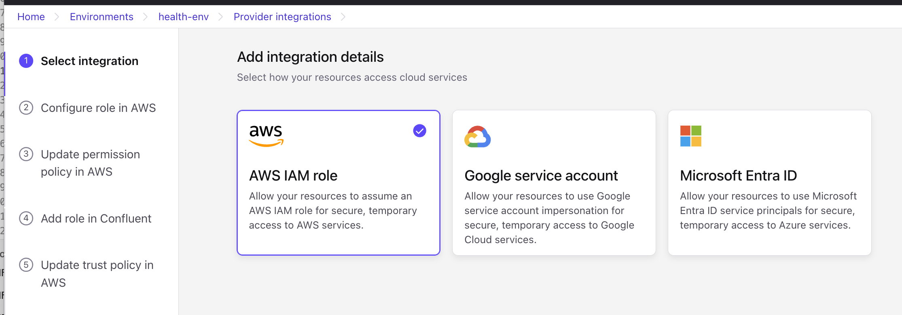
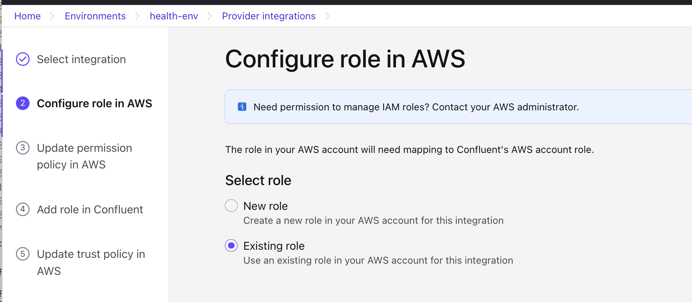
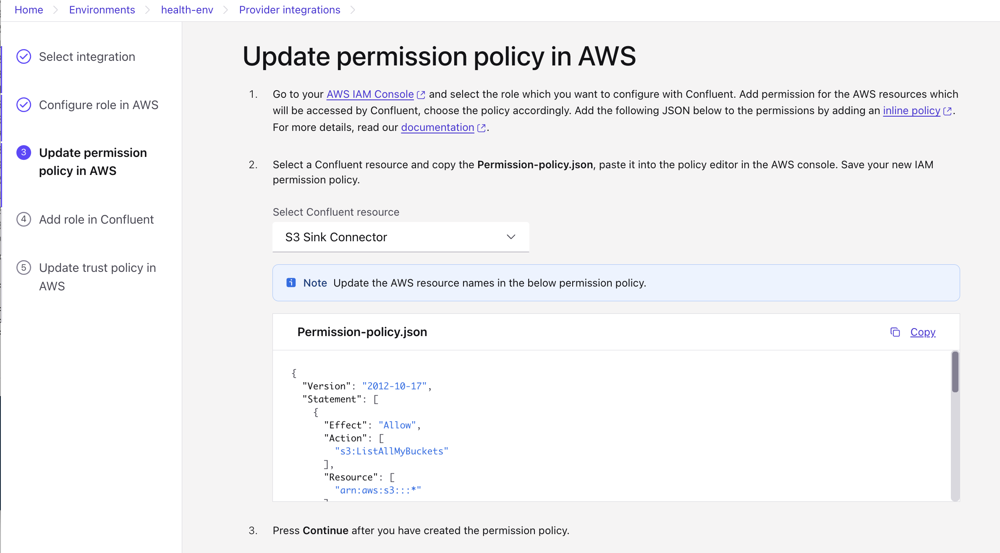
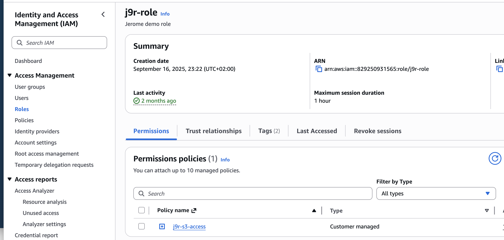
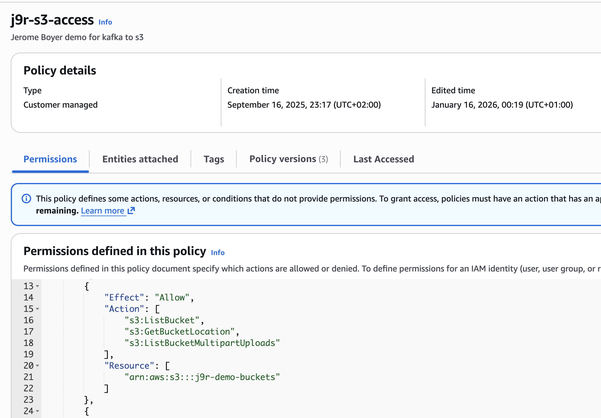
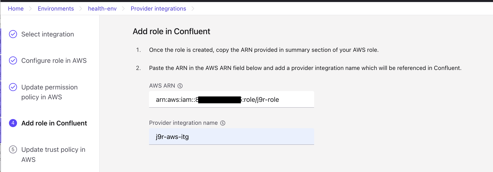
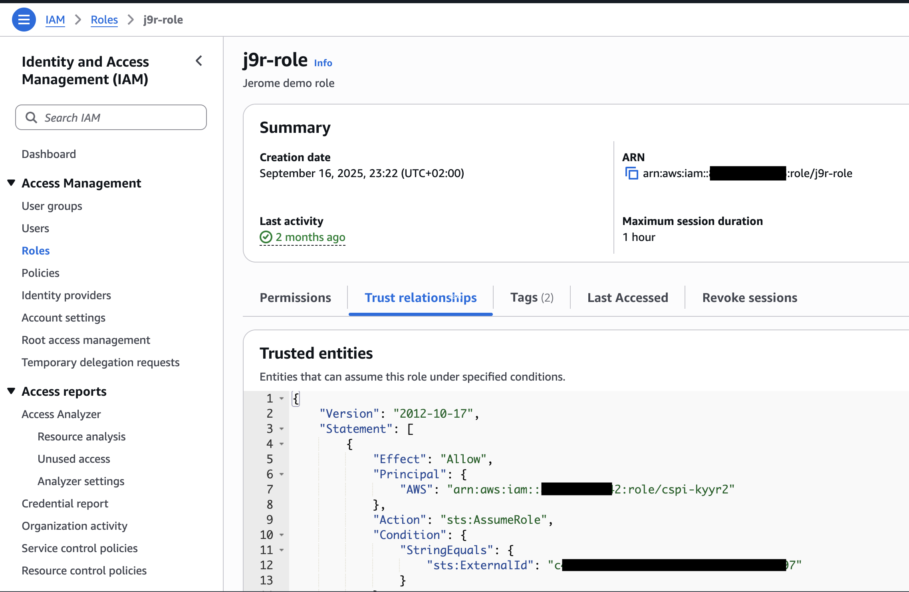
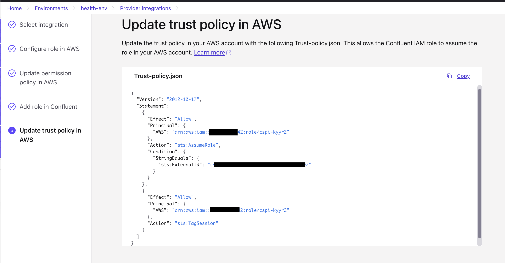
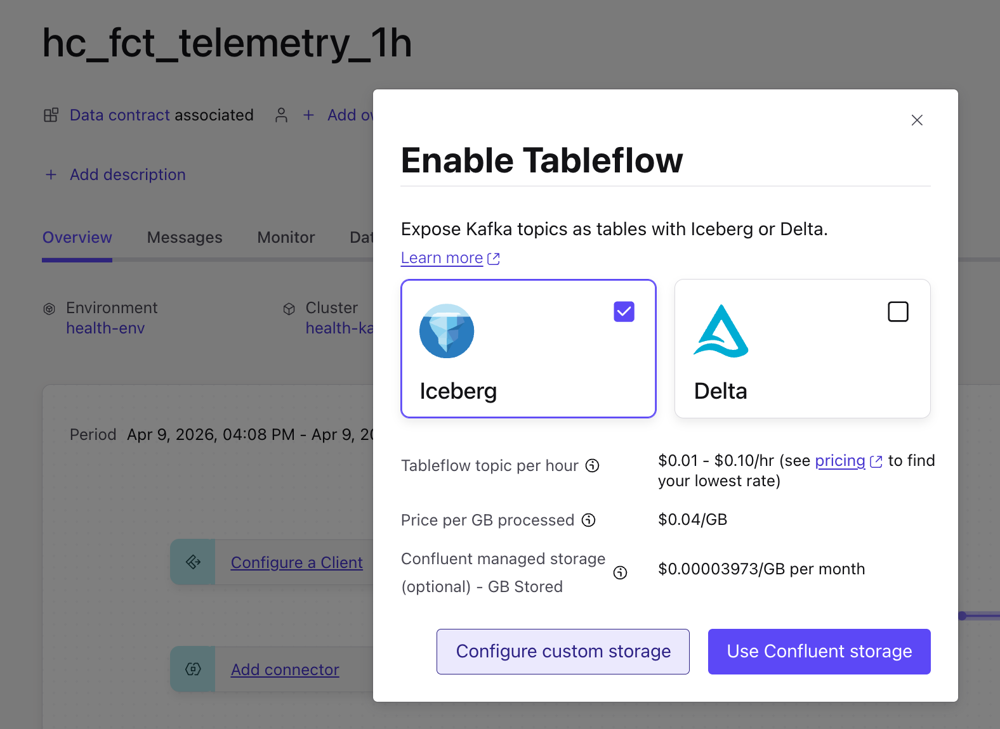
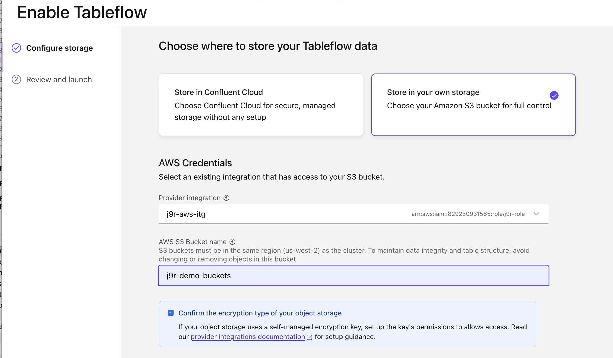

# TableFlow Configuration Steps

Tableflow automatically manages Iceberg tables from Kafka topics, materializing them in S3 without requiring manual Flink jobs. This setup enables Tableflow on the fact tables/topics of this demonstration.

After running `terraform apply`, you need to configure Tableflow connections manually via Confluent Cloud UI.

## Prerequisites

* [x] Terraform infrastructure deployed (`terraform apply` completed)  
* [x] S3 bucket created  
* [x] IAM role ARN available  
* [x] IAM Policy to read, putobject,.. on S3 bucket
* [x] Flink tables running (hc_fct_dev_anomaly, hc_fct_drift_evts, hc_fct_telemetries)

---
## Creating integration

Creating a Confluent Provider Integration to grant CC access to the AWS S3 bucket. 
It uses IAM Roles based authorization. 
The provider integration acts as a trusted identity. See [step by step instructions](https://docs.confluent.io/cloud/current/integrations/provider-integrations/create-provider-integration-aws.html#create-an-aws-provider-integration). When asked to enter AWS role ARN, use your existing IAM role (e.g. arn:aws:iam::8.....5:role/j9r-role).

1. Go to **Confluent Cloud Console**: https://confluent.cloud
1. Select your environment
1. Click **Tableflow** in the left navigation
1. Go to Provider Integration
   
1. Select AWS and then a new IAM role or use an existing IAM role
   

1. Get IAM permission policy for S3 Sink connector: this json policy needs to be updated with the bucket name/arn.
   
1. In AWS Console go to IAM, and select the role to use for the Confluent integration
   

1. Then select the policy to update, then edit json from the json defined in Confluent
   

1. Reference the IAM role in Confluent integration:
   
1. Update the Trusted policy to let Confluent IAM role being able to assume the role we have defined in our AWS account
   

   with the content of:
   

## Enable TableFlow

* Enable TableFlow at the topic level
   
* Select existing Cloud Provider Integration and target S3 bucket
   
   
---


## Get Required Information from Terraform

```bash
cd IaC

# Get S3 bucket name
export BUCKET=$(terraform output -raw s3_analytics_bucket)
echo "S3 Bucket: $BUCKET"

# Get IAM Role ARN
export ROLE_ARN=$(terraform output -raw tableflow_iam_role_arn)
echo "IAM Role ARN: $ROLE_ARN"

# Get External ID (from your terraform.tfvars)
grep confluent_external_id terraform.tfvars
```

You'll need:
- **S3 Bucket Name**: `health-healthcare-analytics-xxxxxxxx`
- **IAM Role ARN**: `arn:aws:iam::YOUR_ACCOUNT_ID:role/health-demo-role`
- **External ID**: Your Confluent External ID

---

## Connection 2: Prescription Changes Data

Repeat the same steps for the drift events table:

1. **Create Connection**: `hc_fct_drift_evts_s3`
   - Same IAM Role ARN
   - Same External ID

2. **Create Sink**:
   - Source Table: `hc_fct_drift_evts`
   - Destination: `s3://your-bucket/prescription_changes/`
   - Format: Parquet
   - Partitioning: date column

---

## Connection 3: Telemetry Data

Repeat for telemetry table:

1. **Create Connection**: `hc_fct_telemetries_s3`
   - Same IAM Role ARN
   - Same External ID

2. **Create Sink**:
   - Source Table: `hc_fct_telemetries`
   - Destination: `s3://your-bucket/telemetries/`
   - Format: Parquet
   - Partitioning: date column

---

## Verification

### Check Tableflow Status

In Confluent UI, verify all 3 sinks show:
- ✅ Status: **Running**
- ✅ Data flow: Shows data being written
- ✅ No errors in logs

### Check S3 Data

```bash
# List files in S3
aws s3 ls s3://${BUCKET}/anomalies/ --recursive
aws s3 ls s3://${BUCKET}/prescription_changes/ --recursive
aws s3 ls s3://${BUCKET}/telemetries/ --recursive

# Expected structure (after a few minutes):
# anomalies/date=2026-04-08/part-00000.parquet
# prescription_changes/date=2026-04-08/part-00000.parquet
# telemetries/date=2026-04-08/part-00000.parquet
```

### Update Backend to Use S3

```bash
# Update backend/.env
cd ../backend

# Add S3 configuration
cat >> .env << EOF

# Analytics S3 Configuration
ANALYTICS_S3_BUCKET=${BUCKET}
ANALYTICS_S3_PREFIX=
AWS_REGION=us-east-2
EOF

# Comment out local path
sed -i.bak 's/^ANALYTICS_LOCAL_PATH=/#ANALYTICS_LOCAL_PATH=/' .env
```

### Restart Backend

```bash
cd ..
docker compose restart backend
```

### Test Analytics Dashboard

```bash
# Wait a moment for backend to restart
sleep 5

# Test API
curl http://localhost:8000/analytics/dashboard | jq '.available'
# Should return: true

# Check data
curl http://localhost:8000/analytics/anomalies-per-device | jq
```

### View in Browser

Open: http://localhost:5173/analytics

You should now see:
- ✅ Real-time data from S3 (not sample data)
- ✅ Charts updating as Tableflow writes new data
- ✅ Data from your actual Flink pipelines

---

## Troubleshooting

### Connection Test Fails

**Error**: "Unable to assume role"

**Fix**:
1. Check IAM Role ARN is correct
2. Verify External ID matches
3. Ensure IAM role trust policy allows Confluent AWS account
4. Check S3 bucket permissions

### Sink Status: Failed

**Error**: "Permission denied"

**Fix**:
1. Verify IAM policy includes S3 write permissions
2. Check bucket name is correct
3. Ensure IAM role is attached to policy

### No Data in S3

**Possible causes**:
1. Flink table has no data yet - check Flink console
2. Tableflow sink just started - wait 5-10 minutes
3. Partition column doesn't exist - check table schema
4. Sink is paused - click "Resume" in Confluent UI

### Backend Can't Read S3

**Error**: "Analytics not available"

**Fix**:
1. Verify `ANALYTICS_S3_BUCKET` in backend/.env
2. Check AWS credentials are configured
3. Ensure backend has S3 read access
4. Restart backend: `docker compose restart backend`

---

## Summary

**Manual Steps Required**: 3 Tableflow connections

Each connection takes ~2-3 minutes to create, total time: **10-15 minutes**

**Why Manual?**
- Confluent Terraform provider doesn't support Tableflow resources yet
- This is the official recommended approach
- Future versions may add Terraform support

**What's Automated?**
- ✅ S3 bucket creation
- ✅ IAM role and permissions
- ✅ Bucket configuration (encryption, versioning, lifecycle)

**What's Manual?**
- ⚙️ Creating Tableflow connections (3x)
- ⚙️ Configuring sinks (3x)

---

**Total Manual Effort**: ~15 minutes (one-time setup)

Once configured, Tableflow runs automatically and continuously syncs data to S3!
