# Demonstration Scenarios

*Review [note](./quick_start.md) to start the demonstration*.

Once the WebApplication is started, all the demonstration happens in this application and within Confluent Cloud Console.

## 1- Review the Domain

* We have fake patients (few of them as the patient volume is not the scope of the demonstration)
<figure markdown="span">
    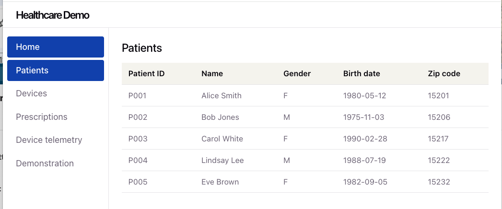
</figure>

* We have a set of devices assigned to patient with 3 major parameters. Those parameters will be used during the simulation to detect anomaly, and work with real-time telemetries.
<figure markdown="span">
    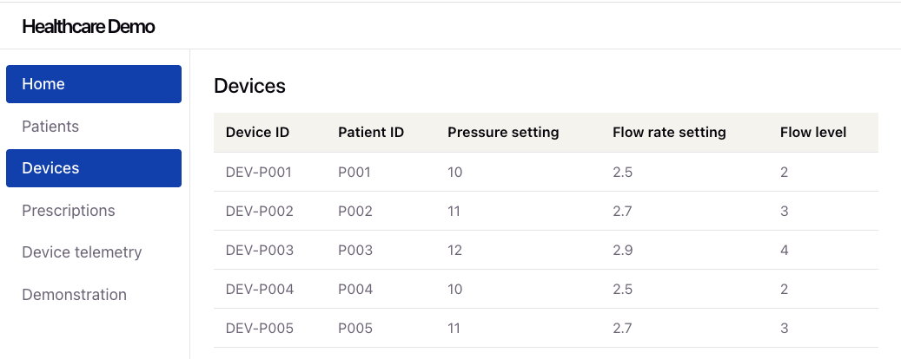
</figure>

* Doctors have set prescriptions to patient that will specify device configuration. A prescription is simply modeled as defining the setting for the different parameters.
<figure markdown="span">
    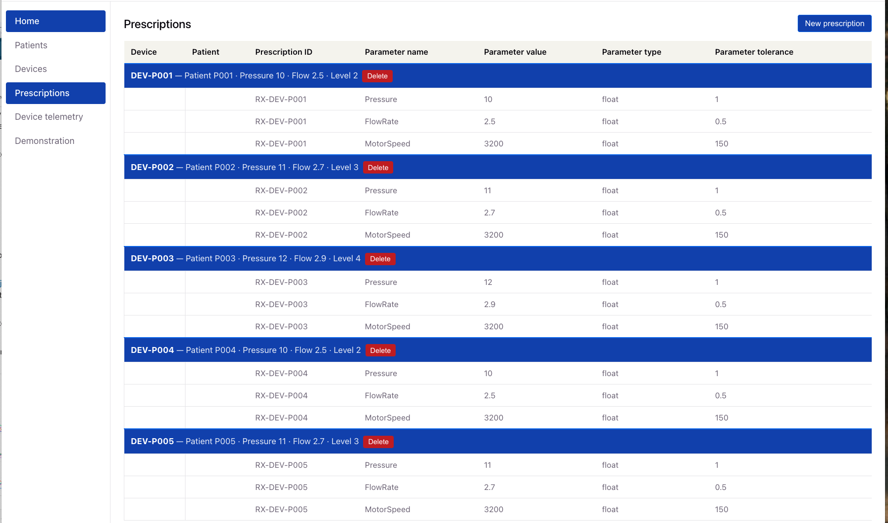
</figure>

For example Patient P002m has the device Dev-P002 assigned, with the settings of Pressure=11, FlowRate of 2.7 and motorspeed 60
## 2- Review the pipeline processing

The git repository includes the pipeline folder, which maps the medaillon structure with `src_, fct_` like:

```sh
pipelines
├── inventory.json
├── raw
│   ├── device_metrics
│   │   ├── sql-scripts
│   │   │   ├── ddl.device_metrics.sql
│   │   │   └── dml.device_metrics.sql
│   ├── raw_devices
│   │   ├── sql-scripts
│   │   │   ├── ddl.raw_devices.sql
│   │   │   └── dml.raw_devices.sql
│   └── raw_patients
│       ├── sql-scripts
│       │   ├── ddl.raw_patients.sql
│       │   └── dml.raw_patients.sql
└── rmd
    ├── dim_patients
    │   ├── sql-scripts
    │   │   ├── ddl.dim_patients.sql
    │   │   └── dml.dim_patients.sql
    ├── hc_fct_drift_evts
    │   ├── sql-scripts
    │   │   ├── ddl.hc_fct_drift_evts.sql
    │   │   └── dml.hc_fct_drift_evts.sql
    ├── hc_fct_telemetries
    │   ├── sql-scripts
    │   │   ├── ddl.hc_fct_telemetry_1h.sql
    │   │   ├── dml.hc_fct_telemetry_1h.sql
    ├── src_devices
    │   ├── sql-scripts
    │   │   ├── ddl.src_devices.sql
    │   │   └── dml.src_devices.sql
    ├── src_patients
    │   ├── sql-scripts
    │   │   ├── ddl.src_patients.sql
    │   │   └── dml.src_patients.sql
    └── src_prescriptions
        ├── sql-scripts
        │   ├── ddl.src_prescriptions.sql
        │   └── dml.src_prescriptions.sql
```

The folder `rmd` represents a way to organize by data product.

### 2.1 The Debezium Connector

Once the Souce connector is started, the connector creates 3 topics (hidden) to manage the metadata of the connectors processing. The Postgresql `prescriptions` table is injected in to the topic `healthcare.public.prescriptions`:

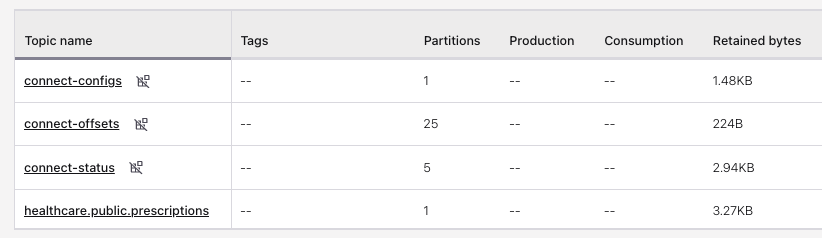

The Avro schemas for the keys and values are in the schema registry, and in Flink Workspace, a query like:
```sql
show create table `healthcare.public.prescriptions`;
``` 

presents the schema definition, like a DDL query.

### 2.1 Debezium Envelop Processing

Debezium CDC connectors automatically registers the message schema when writing to Kafka topics. Using Debezium CDC, the schema structure will include before, after, timestamp, op and sources fields:

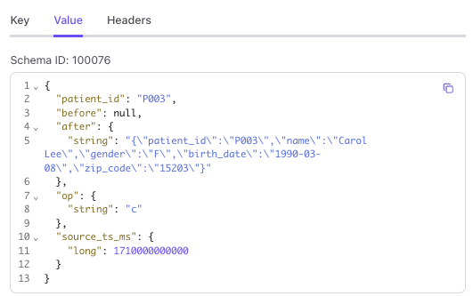

In Confluent Flink there are two options to manage those envelops:

* a/Use the `avro-debezium-registry` serialization: [to automatically detect and interpret this envelope structure based on the schema in Confluent Schema Registry.](https://docs.confluent.io/cloud/current/flink/reference/serialization.html#debezium-format). The `healthcare.public.prescriptions` has the `value.format` set to 'avro-debezium-registry' automatically. Its changelog mode is also set to `retract`:
    ```sql
    show create table `healthcare.public.prescriptions`
    ```

A `select from` query returns the expected record content:
    
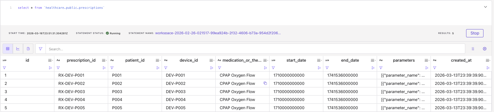


* b/ Use the envelop to keep changelog mode to append only, and when the delete operation needs to be propagated to the downstream processing:
    ```sql
    INSERT INTO hc_src_patients
    WITH normalized AS (
    SELECT
        coalesce(if(op = 'd', before.patient_id, after.patient_id), 'dummy_patient_id') AS patient_id,
        coalesce(if(op = 'd', before.name, after.name), 'dummy_name') AS name,
        coalesce(if(op = 'd', before.gender, after.gender), 'dummy_gender') AS gender,
        coalesce(if(op = 'd', before.birth_date, after.birth_date), 'dummy_birth_date') AS birth_date,
        coalesce(if(op = 'd', before.zip_code, after.zip_code), 'dummy_zip_code') AS zip_code,
        source_ts_ms,
        op
    FROM hc_raw_patients
    ),
    deduped AS (
    SELECT
        patient_id,
        name,
        gender,
        birth_date,
        zip_code,
        source_ts_ms,
        op,
        ROW_NUMBER() OVER (PARTITION BY patient_id ORDER BY source_ts_ms DESC) AS rn
    FROM normalized
    )

    SELECT patient_id, name, gender, birth_date, zip_code, source_ts_ms, op
    FROM deduped
    WHERE rn = 1
    ```

### 2.2 Deduplication

* `changelog.mode=upsert` will remove any duplicate per key. No need to use the `row_number()` pattern
* Still it may be relevant to use the `row_number()` pattern when deduplication needs to be done on specific field outside of the primary key of the sink table, or when the delete needs to be propagaged to the sink, like a parquet table.

### 2.3 Analyze CDC processing
As an example, we will take the following pipeline:
<figure markdown="span">
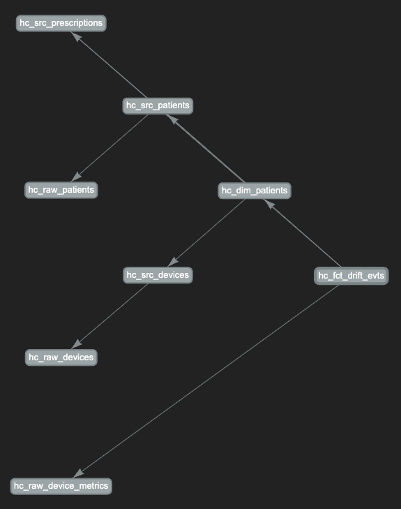
</figure>

1. Verify current state of the Patients Dimension
    ```sql
    select * from hc_dim_patients
    ```

    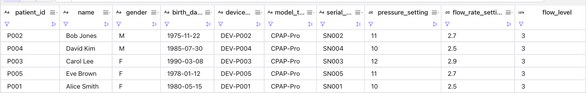

1. Create a new prescription from the User interface: Be sure to select the good device for the patient. (this will be a user interface improvement to be done)
    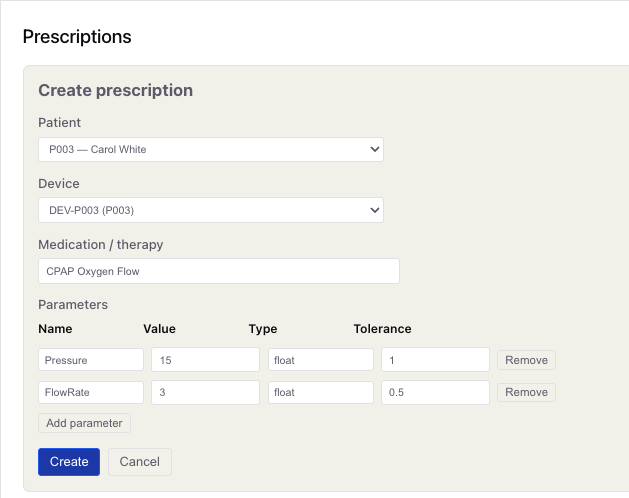


    If you use a SQL query on top of the Postgresql Database, we can see a new row was added:
    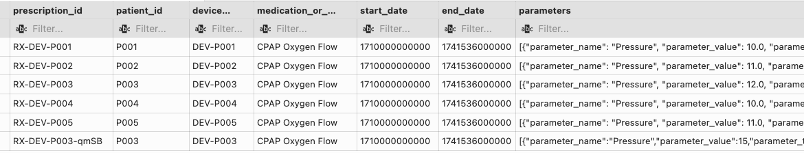

    We can verify in Confluent Cloud the topic has the new record:
    ```sql
    select * from `healthcare.public.prescriptions`
    ```

    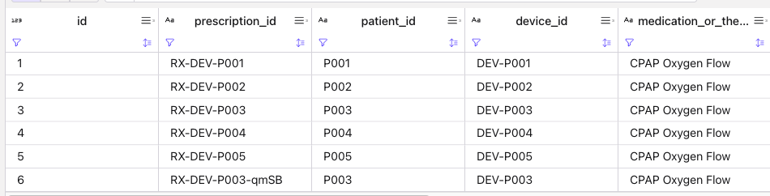


## 3- The first data analytic product

This is counting the number of time a device configuration was changed per patient. We can go step by step to deploy each flink statements, or via one deployment taking care of the full pipeline deployment.

### Step-by-step using Confluent Console - Workspace View

#### Process raw tables
The Patients and Devices are for demonstration purpose created with Flink and with prepopulated records. In the console workspace you can copy paste the SQLs in the following order:

* DDL hc_raw_devices from [https://github.com/jbcodeforce/healthcare-shift-left-demo/tree/main/pipelines/raw/raw_devices/sql-scripts/ddl.raw_devices.sql](https://github.com/jbcodeforce/healthcare-shift-left-demo/tree/main/pipelines/raw/raw_devices/sql-scripts/ddl.raw_devices.sql)
* Insert some records to the hc_raw_devices topic  [https://github.com/jbcodeforce/healthcare-shift-left-demo/tree/main/pipelines/raw/raw_devices/sql-scripts/dml.raw_devices.sql](https://github.com/jbcodeforce/healthcare-shift-left-demo/tree/main/pipelines/raw/raw_devices/sql-scripts/dml.raw_devices.sql)
* Create patients [https://github.com/jbcodeforce/healthcare-shift-left-demo/tree/main/pipelines/raw/raw_patients/sql-scripts/ddl.raw_patients.sql](https://github.com/jbcodeforce/healthcare-shift-left-demo/tree/main/pipelines/raw/raw_devices/sql-scripts/ddl.raw_patients.sq)
* Insert patient records [https://github.com/jbcodeforce/healthcare-shift-left-demo/tree/main/pipelines/raw/raw_patients/sql-scripts/dml.raw_patients.sql](https://github.com/jbcodeforce/healthcare-shift-left-demo/tree/main/pipelines/raw/raw_devices/sql-scripts/dml.raw_patients.sq)

This should be the current state:
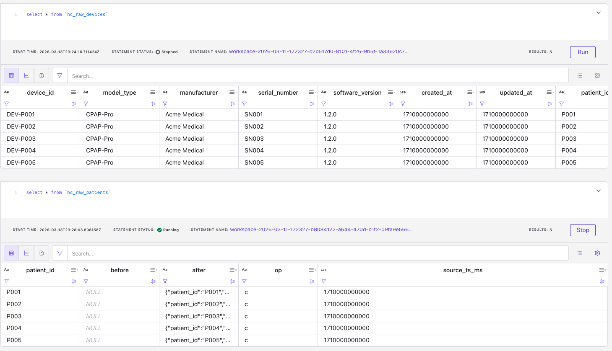

### 