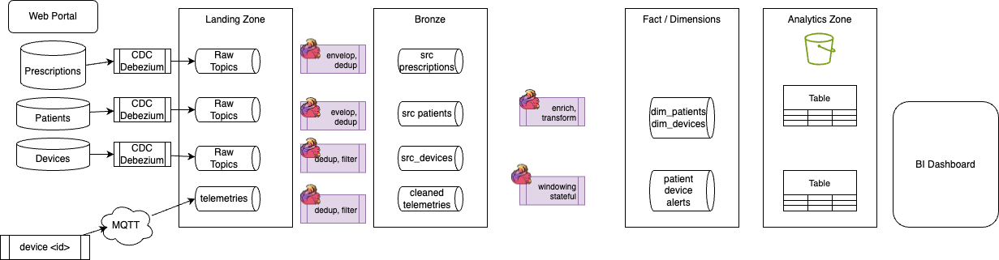
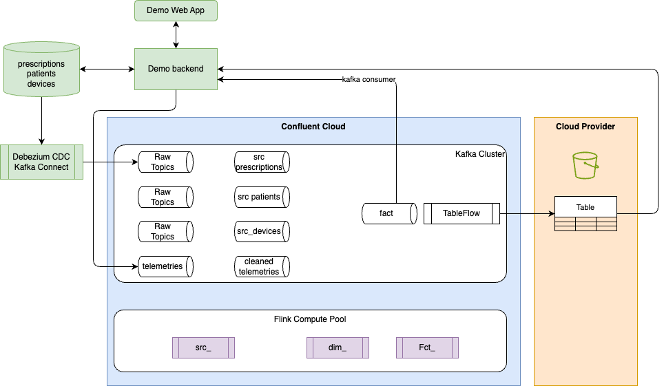
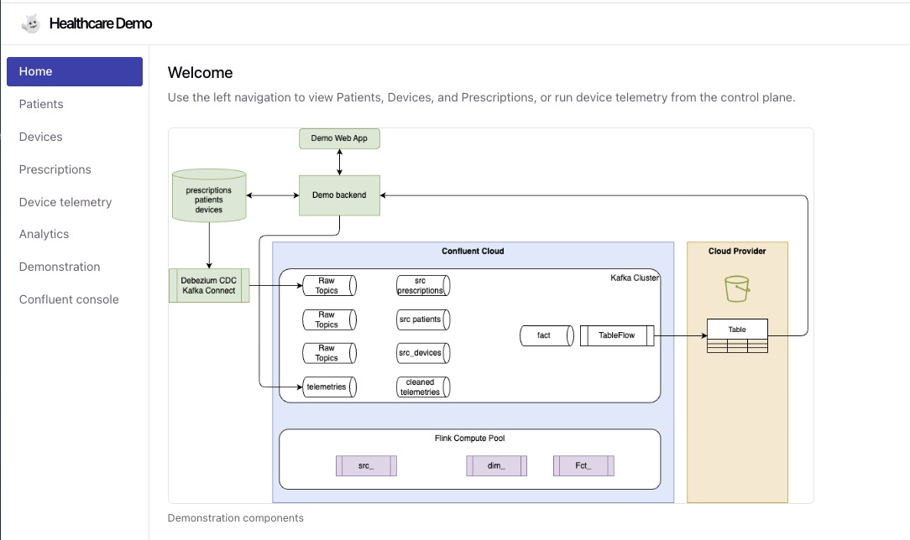
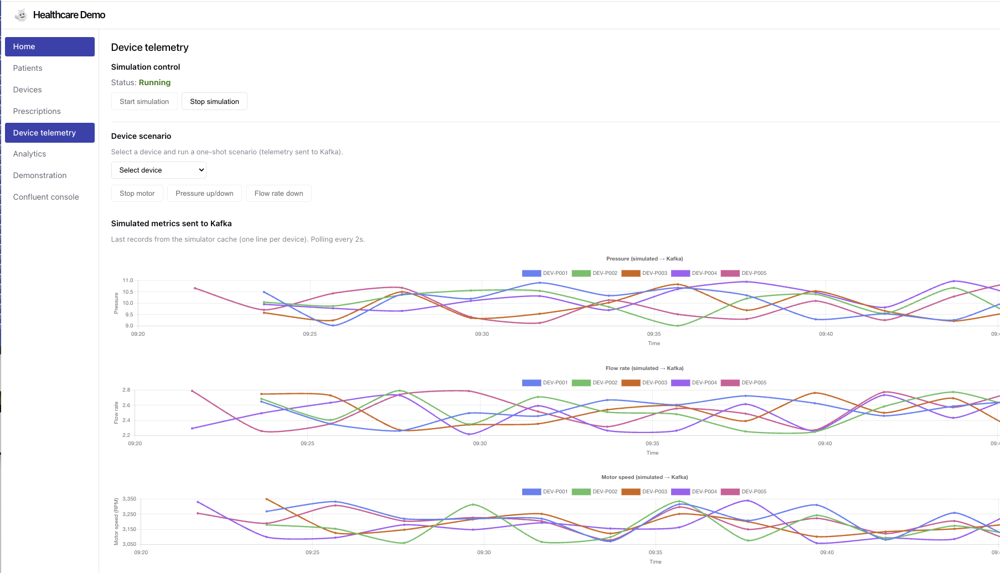

# Introduction

## Goals

The scope of this repository is to build an end-to-end Flink, Kafka, Lake house healthcare demonstration, starting from Debezium CDC to Confluent Cloud Kafka, Flink SQL to process Raw->Bronze->Silver->Gold records, to sink s3 parquet/iceberg tables.

The approach is to use healthcare use case, like Patient records, health providers, prescriptions and device monitoring. The demonstration illustrates device monitoring and compliance to a doctor's prescription. This is a basic domain model but representing enough foundations to present different real-time processing use cases. We use Flink to compare Command/Intent (The Prescription) against Reality (The Telemetry). 

The audiance of this demonstration is data engineers to understand the art of feaseable. 

## Table of Content

* [Demonstration Architecture](#architecture)
* [Use Cases](#use-cases)
* [Demonstration Script](./demonstration_script.md)
* [Implementation Approach](./dev_instructions.md)

## Architecture

### Pipelines Architecture

The figure below presents the production deployment of data streaming pipelines from processing raw data to silver and gold records. The pipeline processing is done using Confluent Cloud Flink SQL queries. 

<figure markdown="span">

</figure>

In this demonstration only Prescription entities are using CDC. The landing zone represents the raw data, while a first layer of Flink processing helps to prepare silver data, with deduplication, schema transformation and filtering.

This diagram also presents a second layer of Flink statements to prepare facts and dimensions as data-as-a-product.

### Demonstration Components

To support this demonstration, the following deployment architecture is defined: 

* the Flink and Topics are running in Confluent Cloud. 
* Sink tables used for Lake house platform are saved in parquet format, with Apache Iceberg metadata, in a Cloud Provider object storage layer.\\
* A webApp supports the demonstration script and presents business intelligence dashboards
* The backend support producing data to Kafka, writing to a Postgresql database, and exposing APIs for dashboards
* Debezium CDC Kafka connector is deployed locally to upload change data capture on the Prescription tables to Kafka
* Confluent Cloud Flink Compute pool is defined to run the Flink SQL statements

<figure markdown="span">

</figure>
The green components are for demonstration purpose and will run on your laptop.

Here is an example of the WebApp home pag, with a sidebar to navigate into the demonstration steps:
<figure markdown="span">

</figure>

### Demonstration Features

* **Backend (FastAPI)** — REST API for patients, devices, and prescriptions; health check; device simulation (start/stop, all or single patient); device telemetry streamed via Server-Sent Events (SSE) and produced to Confluent Cloud Kafka (Avro + Schema Registry).
* **PostgreSQL** — Prescriptions stored in Postgres with logical decoding enabled (`wal_level=logical`) for CDC. One row per prescription; parameters stored as JSON.
* **Prescriptions CRUD** — Create, read, update, and delete prescriptions via API and frontend. Prescription IDs are generated with a 4-character suffix (e.g. `RX-DEV-P002-a3F9`) to avoid duplicates. Requires PostgreSQL (DATABASE_URL).
* **Frontend (Vue.js)** — Control plane with navigation: Home, Patients, Devices, Prescriptions, Device telemetry, Demonstration. List views for patients, devices, and prescriptions (grouped by device); “New prescription” form with patient/device dropdowns and parameter rows; delete prescription per row; simulation control; live telemetry SSE stream.
* **Kafka Connect + Debezium** — Connect runs in Docker Compose; Debezium PostgreSQL connector streams changes from the local `prescriptions` table to Confluent Cloud Kafka (Avro, Schema Registry). Topic prefix `healthcare` (e.g. `healthcare.public.prescriptions`). Register connector with `./connect/register-connector.sh`. The implementation adds a schema name stratefy to support different Schema Registry context.
* **Pipelines** — Flink SQL DDL/DML for raw and RMD layers (e.g. raw_patients, raw_devices, raw_prescriptions, device_metrics). Deploy with shift-left tool to Confluent Cloud Flink.
* **Kafka Consumer** for fact tables to report real-time dashboard back to the business intelligence dashboard 

## Use Cases

### Building golden records

As part of moving from batch to real-time processing the following dimensions and facts can be created. Dimensions are static/slow-moving context (who/what/where), facts are events with timestamps and additive measures.

| Dim/Fact | Explanation | Reference |
|-------|-------------|-----------|
| **dim_patients** | one row per patient (with device and current prescription-derived settings: pressure, flow rate, flow level | [dml.dim_patients.sql](https://github.com/jbcodeforce/healthcare-shift-left-demo/tree/main/pipelines/rmd/dim_patients/sql-scripts/dml.dim_patients.sql) | 
| **fact_drift_events** | Assess devise metric vs prescription, one row per drift alert  | [dml.hc_fct_drift_evts.sql](https://github.com/jbcodeforce/healthcare-shift-left-demo/tree/main/pipelines/rmd/hc_fct_drift_evts/sql-scripts/dml.hc_fct_drift_evts.sql) |
| **Telemetry Facts** | fact_telemetry_1h: windowed aggregates per device/patient/metric. fact_compliance_1h: in-range vs total readings (and optionally compliance_pct) per window. | [dml.hc_fct_telemetry_1h.sql](https://github.com/jbcodeforce/healthcare-shift-left-demo/tree/main/pipelines/rmd/hc_fct_telemetries/sql-scripts/dml.hc_fct_telemetry_1h.sql) |
| **Anomaly Detection** | Fact table to compute anomaly on Pressure, FlowRate or FlowLevel | [hc_fct_dev_anomaly.sql](https://github.com/jbcodeforce/healthcare-shift-left-demo/tree/main/pipelines/rmd/hc_fct_dev_anomaly/sql-scripts/dml.hc_fct_dev_anomaly.sql) |

To study how those facts are created, [see these explanations](./demonstration_script.md).

### Compliance Alerting

Use a join between the Prescription stream with the DeviceTelemetry stream to check for **Prescription Drift**.
The prescriptions change rarely. If DeviceTelemetry.metricValue is outside the Prescription.targetValue +/- toleranceRange for more than X minutes, trigger an alert.
The sink persits alerts in a new Kafka topic: `alerts.compliance.non-adherence`.

### Device's health

With the Device telemetry web page, user can simulate Pressure, flowRate or flowlevel defect. Starting the simulation sends messages to the `hc_raw_device_metrics` topic, for all the 5 devices of the demonstration.

<figure markdown="span">

</figure>

Once the simulation is running, the user can select one of the device and apply one of the 3 simulation.

An [anomaly detection](https://docs.confluent.io/cloud/current/ai/builtin-functions/detect-anomalies.html#ml-detect-anomalies) query can assess the three metrics and report potential issue.

### Other extensions

Goal assess device reliability:

* Windowed Aggregation: Calculate the average Pressure level or rate flow over a 1-hour tumbling window.
* Pattern Recognition: If the Pressure increases by $>10% over three consecutive windows while FlowRate remains constant, the device may have a clogged filter.

If we do an insulin pump, we can have Flink detecting a spike in BloodGlucose (Telemetry). Then checks the Prescription for the maximum allowable dose, to finally sends a command back to a Kafka topic `device.commands` to trigger an insulin bolus automatically.

## Resources

* [Confluent Cloud Flink product documentation](https://docs.confluent.io/cloud/current/flink/overview.html)
* [Guide for Apache Flink and Confluent Flink products](https://jbcodeforce.github.io/flink-studies/)
* [Shift left utils for preparing the Flink SQL project and manage it](https://jbcodeforce.github.io/shift_left_utils)